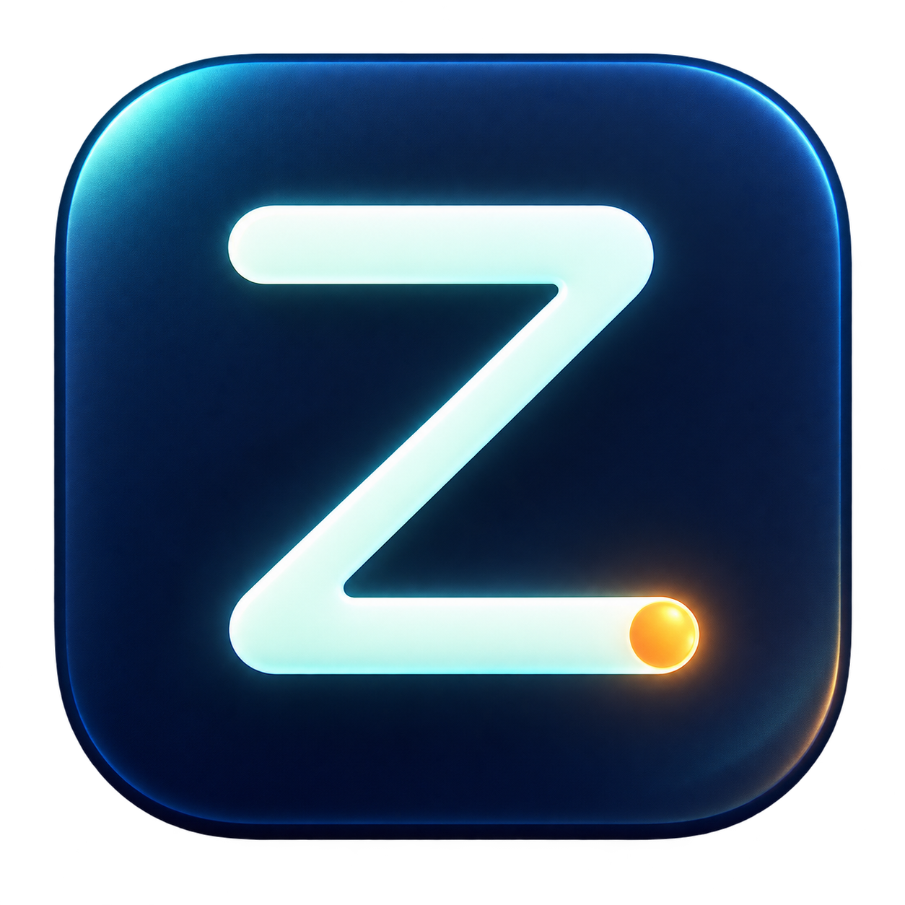
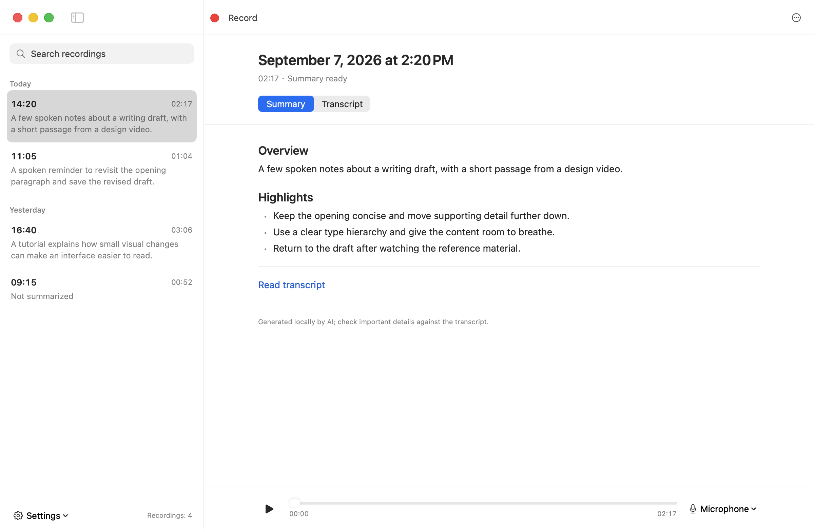

<p align="center">
  
</p>

<h1 align="center">ZebTrace</h1>

<p align="center">
  <strong>保存 Mac 上的声音，随时回顾。</strong><br>
  录下系统声音与麦克风，在本机浏览、回听、转写和总结。
</p>

<p align="center">
  <a href="https://github.com/cutelizebin/zebtrace/releases/tag/v0.4.3"></a>
  
  <a href="https://github.com/cutelizebin/zebtrace/actions/workflows/ci.yml"></a>
  <a href="LICENSE"></a>
</p>

<p align="center">
  <strong><a href="https://github.com/cutelizebin/zebtrace/releases/download/v0.4.3/ZebTrace-0.4.3-universal-preview-unnotarized.dmg">下载 macOS 版</a></strong>
  &nbsp; · &nbsp; <a href="README.md">English</a>
  &nbsp; · &nbsp; <a href="https://github.com/cutelizebin/zebtrace/releases/tag/v0.4.3">版本说明</a>
  &nbsp; · &nbsp; <a href="CONTRIBUTING.md">参与贡献</a>
</p>

<p align="center">
  
</p>
<p align="center"><sub>界面预览使用演示内容，不代表实际 ASR 识别效果。</sub></p>

## 安静地记录，方便地回顾

ZebTrace 平时留在菜单栏，需要时再打开。由你决定何时开始、何时停止，想回顾某个时刻时，就打开录音资料库。它保存系统和麦克风实际收到的声音，不预设会议或任何特定活动。

| 记录 | 回顾 | 理解 |
| --- | --- | --- |
| 从菜单栏开始、暂停。系统声音和麦克风分别保存为独立音轨。 | 按日期浏览，搜索日期或总结，在同一个窗口回听原始音频。 | 用本地模型生成带时间标记的逐字稿和总结，阅读时随时切换到音频核对。 |

- **在本机处理。** 录音和生成的文字保存在你的 Mac 上，无需账号，不上传音频，不收集遥测。
- **文件由你掌管。** 普通的 `.m4a`、Markdown 和 JSON 文件，保存在你选择的目录；模型也放在同一位置。
- **原生 Mac 应用。** 简洁的资料库、小巧的播放器，以及统一的模型下载、删除与存储设置。
- **中文与 English。** 默认跟随系统语言，也可手动切换；通过[本地化资源](docs/localization.md)扩展更多语言。

## 下载后即可开始

**[下载 Universal DMG](https://github.com/cutelizebin/zebtrace/releases/download/v0.4.3/ZebTrace-0.4.3-universal-preview-unnotarized.dmg)** · [ZIP、校验和与版本说明](https://github.com/cutelizebin/zebtrace/releases/tag/v0.4.3)

需要 **macOS 14.2 或更新版本**。同一个应用包含 Apple Silicon 和 Intel 原生版本。使用安装包**无需安装 Python、Homebrew、FFmpeg、Ollama 或 Xcode，也不需要账号**。

1. **安装。** 打开 DMG，将 **ZebTrace.app** 拖入 **Applications（应用程序）**。
2. **录音。** 打开应用，点击菜单栏的 **Z**，选择「**开始记录**」，按系统提示授权麦克风与系统音频。
3. **回顾。** 「**暂停并保存**」后点击「**打开主界面**」。选择录音回听，或点击「**转写并总结**」生成逐字稿和总结。

> **首次打开：** 本预览版尚未公证。如被 macOS 阻止，请确认下载来源可信，先尝试打开一次，再前往「**系统设置 → 隐私与安全性 → 仍要打开**」。参见 [Apple 官方说明](https://support.apple.com/en-us/102445)。

录音本身不需要模型。首次本地回顾会请求下载**约 3.1 GB** 的模型文件，所有录音共用。下载支持续传，并按预设的 SHA-256 校验。模型准备好后，转写和总结均可离线运行。

**从旧版升级？** 先暂停保存并退出旧应用，再替换安装。已有录音保留在原位置。权限与排错说明见[完整参考文档](docs/usage-reference.md)或[中文使用指南](docs/quick-start.zh-CN.md)。

## 本地模型，统一管理

在「**设置 → 模型与存储…**」中选择模型。应用负责下载和推理，选择仅影响后续处理。

| 工作 | 当前可选模型 |
| --- | --- |
| 语音 → 逐字稿 | 默认 **Whisper large-v3-turbo · Q5**，也可选择 **Whisper large-v3 · Q5** |
| 逐字稿 → 总结 | **Qwen3 4B · Q4** |
| 转写前的语音检测 | **Silero v6.2.0** |

转写和总结依次运行，完成后推理进程退出，释放占用的内存。「**保存后自动总结**」可选且默认关闭。录音独立于这些模型运行。

完整版 Whisper 语音模型约 **1.08 GB**，完整模型组合约 **3.6 GB**；已下载的共用文件会复用。当前会一起准备语音识别、总结和语音检测模型。详见[模型选择与识别效果](docs/asr-quality.md)及[模型与许可证](docs/local-review.md#models-and-licenses)。

## 一个目录，普通文件

默认保存到 **`~/Downloads/ZebTrace`**。你可以在应用中选择其他目录；下载的模型随保存位置迁移，已有录音仍留在原来的位置。

```text
ZebTrace/
├── Models/                         共用的本地模型
└── 2026-09-07/
    └── 2026-09-07_09-30-00/         一次录音
        ├── system-00001.m4a
        ├── microphone-00001.m4a
        ├── session.json
        ├── transcript.md           转写后生成
        ├── summary.md              总结后生成
        └── …                       元数据与可复用的分析缓存
```

音频边录边写，默认每 **10 分钟**分段，也可选择 1、5、10、30 或 60 分钟。暂停时即保存当前片段，无需等满分段时长。收到的非语音声音和安静时段同样保留；语音检测只影响转写。

在设置中删除不再需要的模型，或使用「**清理与卸载…**」清理受管理的数据与偏好设置。录音默认保留，只有明确选择包含录音时才会处理。仅在访达中删除应用，不会删除它的数据。[存储格式与清理说明 →](docs/usage-reference.md#saved-data)

## 预览版目前的边界

逐字稿和总结都可能出错，请对照原始音频核对重要内容。麦克风与系统声音标识的是**采集来源，不是人的身份**。目前尚未实现身份识别、可靠的说话人分段、回声消除或双轨同步混音播放；音乐和环境声音事件也还不能可靠描述。

**Qwen3 目前负责文本总结，Qwen3-ASR 尚未集成。** Universal 构建会经过 CI 检查，但 Intel 推理和蓝牙设备切换仍需要真机验证。已测试范围见[发布验证说明](docs/release-readiness.md)。

后续将围绕转写质量、说话人分段与跨音轨关联展开，保留原始文件，让模型能够替换。[音频理解设计](docs/audio-understanding-design.md)描述的是后续方案，不代表本版已经支持。

## 构建与贡献

从源码构建需要 **Xcode 15.1+**，或兼容的 **Swift 5.9+ / macOS 14.2+ SDK** 工具，以及 **CMake**。首次构建会获取经过校验、版本固定的 whisper.cpp 和 llama.cpp 源码，并打包原生推理组件，不会下载模型权重。

```sh
git clone https://github.com/cutelizebin/zebtrace.git
cd zebtrace
make run       # 构建并打开应用；录音仍需手动开启
make test      # 运行隔离测试，不会录音
make check     # 测试、脚本/plist 检查及应用构建
make package   # Universal 预览 DMG、ZIP 和校验和
```

欢迎提交问题、翻译、文档改进和围绕具体问题的 Pull Request。开始前请阅读 [CONTRIBUTING.md](CONTRIBUTING.md)；安全漏洞请按 [SECURITY.md](SECURITY.md) 中的方式报告。

| 了解更多 | 文档 |
| --- | --- |
| 使用应用 | [完整使用参考](docs/usage-reference.md) · [中文使用指南](docs/quick-start.zh-CN.md) |
| 理解代码 | [架构](docs/architecture.md) · [本地推理](docs/inference-runtime.md) · [可扩展性](docs/extensibility-review.md) |
| 改进体验 | [界面设计](docs/interface-design.md) · [本地化](docs/localization.md) |
| 发布版本 | [分发与打包](docs/distribution.md) · [验证](docs/release-readiness.md) · [更新日志](CHANGELOG.md) |

## 许可证

[MIT](LICENSE) · © 2026 ZebTrace contributors。随包组件与下载的模型保留各自的[许可证和声明](docs/local-review.md#models-and-licenses)。
