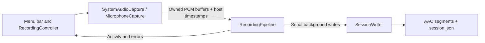

# Architecture

ZebTrace is a native Swift menu bar application with a local recording pipeline. The `ZebTrace` executable owns user interaction and recording lifecycle; `ZebTraceCore` owns capture, buffering, session metadata, and file persistence. There are no external package dependencies or network services.

## Boundaries

| Component | Responsibility |
| --- | --- |
| `AppDelegate` / `RecordingController` | Menu status, permissions, save-folder and segment-length selection, explicit start/pause, source health checks, sleep handling, and orderly quit; lifecycle changes run on the main actor. |
| `AudioCapturing` implementations | System playback through a private Core Audio tap and aggregate device; default microphone through AVAudioEngine. They deliver owned PCM buffers and source timestamps, observe device changes, and release capture resources on stop. |
| `RecordingPipeline` | Bound pending buffers, serialize writes off the audio callback, publish per-source activity, check available disk space, and report failures. Stopping rejects new buffers and queues finalization after already accepted work. |
| `SessionWriter` | Create session directories, encode separate AAC tracks, rotate segments, preserve offsets and gaps, and atomically replace the JSON manifest. |

Capture callbacks copy the samples they own before handing them to the pipeline. Encoding and file I/O happen continuously on the pipeline's serial background queue. The current queue limit is 256 pending buffers; overload pauses recording instead of allowing the backlog to grow indefinitely. Segment duration controls file rotation, not PCM retention: a 10-minute segment does not accumulate 10 minutes of PCM in memory. This is a demo implementation, without a hard real-time performance guarantee.

## Manual lifecycle

The app always launches idle. Clicking **开始记录** moves through `starting` to `recording`: request microphone access if needed, create a new session, start the microphone, and start the system tap. A recording-attempt identifier prevents stale asynchronous permission or error callbacks from affecting a later session.

Clicking **暂停并保存** stops both capture sources, drains accepted work, closes current segments, and finishes the manifest before returning to idle. Starting again creates a new session; it does not append to the previous one. Quit waits for this finalization. Sleep, capture/device failures, a microphone data timeout of 12 seconds, low disk space, or write failures also stop capture. Errors remain visible in the menu.

Finalization retains its first result. Repeated stop requests cannot turn a failed save into success or append more audio to a closed session; queued failures retain the first reported cause.

System playback can legitimately deliver no buffers when nothing is playing. The app shows **等待声音…** without stopping the session for that reason. System audio permission denial can also appear as silence, so an audible playback and saved-file check is required to establish that capture works. Source indicators are activity hints, not a guarantee that all expected meeting audio was captured.

Launch, wake, permission changes, and recovery never start recording automatically. The app acquires both the current and legacy instance locks, in a consistent order, to prevent concurrent recording across versions. On launch, recovery examines only the currently selected recording root and marks sessions still in `recording` as `interrupted`. Recovery updates metadata without resuming capture, repairing an unfinished AAC container, or automatically traversing previous default folders.

## Timestamps and storage

Both sources deliver the host-clock timestamp for the start of each audio buffer. A session stores its host-clock origin and tick frequency; each segment stores `startOffsetSeconds` relative to that origin. Wall-clock ISO 8601 dates describe the session lifecycle. Segment offsets preserve the separate start times of the microphone and system tap and any gaps in delivery.

Each source rotates independently at the selected duration, on buffer boundaries. The default is 600 seconds (10 minutes). The **分段时长** submenu offers 1, 5, 10, 30, and 60 minutes; the selection is persisted, cannot change during recording, and is passed into the next recording pipeline. Pausing always finalizes the current segment, including a partial one. A format change or timestamp discontinuity greater than 100 ms also opens a new segment. Consumers must use the offsets rather than concatenate files and assume they start together. The demo does not mix tracks, cancel echo, or guarantee sample-perfect synchronization.

The default recording root is `~/Downloads/ZebTrace`. The menu exposes a native folder picker and displays the current location. A custom selection is persisted across launches and passed into the next recording pipeline. The location cannot change while recording; pause and finalize the current session before selecting another root. A missing custom directory or unavailable disk produces an explicit error requiring a new selection, without silently falling back to another folder.

Changing the recording root never moves or deletes existing data. Recording-folder actions in the menu use the current selection or the most recent session. Choosing a new root limits subsequent recovery to that selected directory.

ZebTrace uses the `org.zebtrace.app` application and preferences domain. A one-time migration imports custom save-folder and segment-length settings from `org.mycontext.app` without replacing values already set for ZebTrace. This does not migrate recordings or remove the old application. The changed bundle identifier requires fresh macOS audio permissions; a settings migration does not transfer permission grants.

Completed segments are normal AAC `.m4a` files accompanied by a versioned `session.json`. Session directories and files use owner-only permissions. The manifest is checkpointed while recording and finalized on a normal stop; a crash may leave the latest file incomplete. A longer segment increases this potential loss window even though audio is written continuously. There is no application-level encryption, automatic deletion, upload, or transcription. The selected directory may be covered by operating-system backup or synchronization independently of ZebTrace.

## Localization and distribution

`LanguagePreferences` persists an explicit language or follows the first supported macOS language, with English as the fallback. `L10n` reads the current choice on each lookup and loads English or Simplified Chinese from the app's bundled SwiftPM resources. Menu changes update presentation without restarting or changing a recording session. Persisted session metadata and filenames remain language-independent.

The main bundle separately includes localized permission descriptions in `InfoPlist.strings`. System-owned dialogs follow macOS language rules. Resource lookup prefers `Contents/Resources` inside the installed app and handles SwiftPM's lowercased locale directory names; it does not require the development checkout.

Preview packaging combines native `arm64` and `x86_64` executables, removes build-machine runtime search paths from the staged copy, verifies dependencies, and produces a DMG and ZIP. It uses ad-hoc signing until Developer ID credentials are configured. See [distribution instructions](distribution.md) for the optional signing and notarization path.

## Current validation boundary

Unit tests cover core lifecycle, timestamp, segmentation, and persistence behavior with synthetic audio. Interactive permissions, actual devices, and full meeting capture require manual testing. Starting the microphone before the system tap accounts for possible output format changes, but Bluetooth hands-free profile transitions have not been validated on real hardware. Use a built-in microphone with headphone output for the initial demo check.
