# Architecture

ZebTrace is a native Swift menu bar application with an optional main recording library and separate recording and local analysis pipelines. The `ZebTrace` executable owns interaction and lifecycle; `ZebTraceCore` owns capture and recording persistence; `ZebTraceAnalysis` owns model preparation, transcription, and summaries. There are no external Swift package dependencies or hosted inference services. The app downloads model files only after explicit first-use confirmation. This document describes the 0.4.3 preview; the earlier v0.2.0 release records audio only.

The product does not assume a recording setting or activity. Manual recording saves received system and microphone samples independently of speech content. VAD and ASR belong exclusively to analysis of saved recordings; they do not gate capture or remove non-speech from original audio. Missing transcript text cannot establish silence or an absence of activity. The current analysis pipeline has no reliable music or environmental sound-event recognition, so the summary remains a review of recognized speech.

```mermaid
flowchart LR
    UI[Menu bar / library / RecordingController] --> Capture[SystemAudioCapture / MicrophoneCapture]
    Capture -->|Owned PCM buffers + host timestamps| Pipeline[RecordingPipeline]
    Pipeline -->|Serial background writes| Writer[SessionWriter]
    Writer --> Files[AAC segments + session.json]
    Pipeline -->|Activity and errors| UI
    Files -->|Completed session| Review[AnalysisController / SessionAnalysisService]
    Review --> Speech[TranscriptionProvider]
    Speech --> Transcript[Timeline transcript]
    Transcript --> Summary[SummarizationProvider]
    Summary --> Results[Validated results + recording library]
```

## Boundaries

| Component | Responsibility |
| --- | --- |
| `AppDelegate` / `RecordingController` | Menu status, permissions, save-folder and segment-length selection, explicit start/pause, source health checks, sleep handling, and orderly quit; lifecycle changes run on the main actor. |
| `AudioCapturing` implementations | System playback through a private Core Audio tap and aggregate device; default microphone through AVAudioEngine. They deliver owned PCM buffers and source timestamps, observe device changes, and release capture resources on stop. |
| `RecordingPipeline` | Bound pending buffers, serialize writes off the audio callback, publish per-source activity, check available disk space, and report failures. Stopping rejects new buffers and queues finalization after already accepted work. |
| `SessionWriter` | Create session directories, encode separate AAC tracks, rotate segments, preserve offsets and gaps, and atomically replace the JSON manifest. |
| `AnalysisController` | One review/download task, first-use consent, progress, cancellation, saved-session selection, and optional automatic review; task generations reject stale callbacks. |
| `LocalModelStore` | Shared models under the selected recording root, pinned download identity, size/hash verification, resumable transfers, validated relocation, and explicit removal. |
| `SessionAnalysisService` | Validate completed sessions, normalize audio, preserve source timing, reuse compatible cached work, combine transcript evidence, and write results. |
| `TranscriptionProvider` / `SummarizationProvider` | Invoke the selected inference implementation for one stage, without owning recording or UI state. The native helpers are separate processes. |
| `RecordingLibrary` | Scan the selected root, validate manifests and result provenance, and resolve a selected session into readable content and playable local chunk references. |
| `RecordingLibraryWindowController` / `RecordingLibraryModel` | One reusable native library, selection and search, asynchronous catalog loads, per-session progress, Markdown/transcript presentation, and explicit single-segment playback. |
| `WorkspaceController` / model and storage windows | Connect management UI to lifecycle owners; confirm model/recording removal and cleanup, and keep data-root changes orderly. |
| `ManagedStorage` | Inventory recognized app files and validate session ownership, paths, and exclusive access before Trash operations. |

Capture callbacks copy the samples they own before handing them to the pipeline. Encoding and file I/O happen continuously on the pipeline's serial background queue. The current queue limit is 256 pending buffers; overload pauses recording instead of allowing the backlog to grow indefinitely. Segment duration controls file rotation, not PCM retention: a 10-minute segment does not accumulate 10 minutes of PCM in memory. This is a demo implementation, without a hard real-time performance guarantee.

## Manual lifecycle

The app always launches idle. Clicking **开始记录** moves through `starting` to `recording`: request microphone access if needed, create a new session, start the microphone, and start the system tap. A recording-attempt identifier prevents stale asynchronous permission or error callbacks from affecting a later session.

Clicking **暂停并保存** stops both capture sources, drains accepted work, closes current segments, and finishes the manifest before returning to idle. Starting again creates a new session; it does not append to the previous one. Quit waits for this finalization. Sleep, capture/device failures, a microphone data timeout of 12 seconds, low disk space, or write failures also stop capture. Errors remain visible in the menu.

Finalization retains its first result. Repeated stop requests cannot turn a failed save into success or append more audio to a closed session; queued failures retain the first reported cause.

System playback can legitimately deliver no buffers when nothing is playing. The app shows **等待声音…** without stopping the session for that reason. System audio permission denial can also appear as silence, so an audible playback and saved-file check is required to establish that capture works. Source indicators are activity hints, not a guarantee that all expected audio was captured. The microphone timeout detects missing sample buffers, not a quiet signal or the absence of speech.

Launch, wake, permission changes, and recovery never start recording automatically. The app acquires both the current and legacy instance locks, in a consistent order, to prevent concurrent recording across versions. On launch, recovery examines only the currently selected recording root and marks sessions still in `recording` as `interrupted`. Recovery updates metadata without resuming capture, repairing an unfinished AAC container, or automatically traversing previous default folders.

## Timestamps and storage

Both sources deliver the host-clock timestamp for the start of each audio buffer. A session stores its host-clock origin and tick frequency; each segment stores `startOffsetSeconds` relative to that origin. Wall-clock ISO 8601 dates describe the session lifecycle. Segment offsets preserve the separate start times of the microphone and system tap and any gaps in delivery.

Each source rotates independently at the selected duration, on buffer boundaries. The default is 600 seconds (10 minutes). The **分段时长** submenu offers 1, 5, 10, 30, and 60 minutes; the selection is persisted, cannot change during recording, and is passed into the next recording pipeline. Pausing always finalizes the current segment, including a partial one. A format change or timestamp discontinuity greater than 100 ms also opens a new segment. Consumers must use the offsets rather than concatenate files and assume they start together. The demo does not mix tracks, cancel echo, or guarantee sample-perfect synchronization.

The default recording root is `~/Downloads/ZebTrace`. The menu exposes a native folder picker and displays the current location. A custom selection is persisted across launches and passed into the next recording pipeline. The location cannot change while recording; pause and finalize the current session before selecting another root. A missing custom directory or unavailable disk produces an explicit error requiring a new selection, without silently falling back to another folder.

New sessions use `<root>/yyyy-MM-dd/yyyy-MM-dd_HH-mm-ss/`, formatted from their start time using the local time zone and Gregorian calendar. An existing name causes a suffix of `_02`, `_03`, and so on instead of overwriting a session. The UUID remains the manifest's `id`, independent of the folder name. Recovery recognizes both this layout and the earlier `<root>/yyyy-MM-dd/HH-mm-ss-<UUID>/` layout within the selected root; legacy folders stay in place and are not automatically renamed or migrated.

The optional manifest field `directoryName` records the new session's leaf folder name at creation so recovery can validate its ownership after a time-zone change. Older manifests omit this field, and legacy folders continue to be matched by UUID.

Changing the recording root never moves or deletes existing data. Recording-folder actions in the menu use the current selection or the most recent session. Choosing a new root limits subsequent recovery to that selected directory.

ZebTrace uses the `org.zebtrace.app` application and preferences domain. A one-time migration imports custom save-folder and segment-length settings from `org.mycontext.app` without replacing values already set for ZebTrace. This does not migrate recordings or remove the old application. The changed bundle identifier requires fresh macOS audio permissions; a settings migration does not transfer permission grants.

Completed segments are normal AAC `.m4a` files accompanied by a versioned `session.json`. Session directories and files use owner-only permissions. The manifest is checkpointed while recording and finalized on a normal stop; a crash may leave the latest file incomplete. A longer segment increases this potential loss window even though audio is written continuously. There is no application-level encryption, automatic recording deletion, or audio upload. The selected directory may be covered by operating-system backup or synchronization independently of ZebTrace.

## Optional analysis lifecycle

The main library and compact Recording Review submenu share the same analysis controller. Manual review accepts a completed session, including a selected historical folder. Automatic review is a persisted, default-off option available only after models are ready. `RecordingController.onSaved` notifies it only after successful `userPaused` finalization; sleep, quit, and capture failure do not start inference. Sleep or quit during pending finalization also suppresses that notification.

Starting capture cancels analysis and waits for its helper to exit. Sleep cancels pending work; quit waits for both recording finalization and analysis shutdown. A new review cannot start until cancellation finishes. Failures remain in the review menu and only manual operations show an alert; analysis errors do not pause or fail recording. Launch and wake do not resume canceled analysis automatically.

Audio normalization streams the original chunk into mono 16 kHz PCM, then each helper request uses a short window of at most 24 seconds, normally split near a low-energy boundary around 20 seconds. Language detection runs per window, with the auxiliary Silero VAD model filtering non-speech. The transcription adapter returns text and model-estimated segment times; the service adds the window offset and each chunk's original offset before merging the two sources chronologically. Completed windows have separate cache entries for cancellation/retry. It annotates only substantial exact normalized cross-track matches with temporal overlap, preserving both texts. There is no acoustic echo cancellation, speaker identification, or claim of forced alignment.

The service writes `transcript.md`, `transcript.json`, and a `transcription.json` checkpoint before summarization, then writes `summary.md` and `analysis.json` on success. When replacing a review, it retains the previous files privately in `.zebtrace-analysis/previous-review` and removes the old public summary/completion marker before publishing a new transcript. A failed summary leaves saved transcript access available without presenting an older summary as a new success. Private work and reusable caches live in `.zebtrace-analysis` inside the session, protected by a per-session process lock. Cache identity incorporates content, source timing, preprocessing/cache version, model/runtime identity, and relevant summary language/stage. Original audio is not rewritten.

ASR and summary helpers run serially with four requested CPU threads and exit after their work, rather than keeping both models resident. Long transcript text is split into sections and recursively condensed; sections have a conservative 5,000-byte UTF-8 limit to leave room for instructions and output within the summary helper's 8,192-token context. This byte limit is not an exact token count. Bounded failures preserve the transcript instead of silently truncating it. This is not a guarantee of fixed memory use, accuracy, or unlimited recording duration. `TranscriptionProvider` and `SummarizationProvider` allow independent replacement in code; the model UI offers two curated Whisper ASR choices and one shared summary model, with persistent ASR selection and preparation limited to its required files. See [local review](local-review.md) for inputs, outputs, model licenses, and the developer harness.

## Library, models, and cleanup

Library scans run off the main actor when the root or task lifecycle changes, when the window opens, or after an explicit refresh. Progress updates may reread only the selected session; they do not rescan every recording on each timer tick. Rows are sorted by manifest `startedAt`, independently of legacy versus timestamp directory names. Search and date grouping are presentation concerns.

The catalog checks the selected manifest ID again when loading details. Result checkpoints must match that ID; current checkpoints additionally bind the source manifest and generated content hashes. Legacy results without hashes retain session-ID compatibility. No global “latest result” can fill an unrelated selection. A new selection clears the previous detail immediately, and URL plus generation guards reject stale asynchronous completions. Automatic analysis completion refreshes data without selecting a different session. During a rerun, the selected session can show saved transcript content without showing an older summary as fresh output.

Playback accepts only the catalog's regular local segment files. It starts on a user click, plays one source segment at a time, and displays segment time plus the original session offset. A transcript-time click seeks the corresponding source chunk; timing remains a model estimate. Changing selection, closing the window, or starting capture stops playback. Closing the main window leaves the menu bar app and recording lifecycle running.

Models live at `<selected root>/Models`, defaulting to `~/Downloads/ZebTrace/Models`. Audio, generated documents, and hidden per-session caches remain under the same root. A location change validates and relocates recognized model files while leaving existing recording folders in place. The app remembers previously selected roots for explicit storage management; recording recovery and library browsing still use only the currently selected root. Legacy application-support model storage can migrate into the selected root. Unknown files are not treated as managed models.

Deleting generated content, deleting a recording, removing model files, and releasing inference memory are separate actions. The UI supplies intent through callbacks; `WorkspaceController` checks lifecycle state and obtains confirmation before `ManagedStorage` validates the operation. Recording and generated-content removal use Trash, including the hidden cache when removing the complete session. Cleanup preserves recordings by default and can include recognized sessions only after opt-in. Uninstall additionally moves the app to Trash. Availability and exclusive-access checks can stop cleanup rather than deleting an unsafe target. Settings and macOS-managed caches remain in their standard system locations until explicit cleanup.

Finder removal has no app uninstall callback. In-app cleanup must be requested before removing the app if the user wants its data cleaned too. Unavailable previous volumes and unknown user files are not silently removed, and moving files to Trash does not immediately reclaim disk space. macOS owns permission records; app cleanup does not edit the privacy database.

## Localization and distribution

`LanguagePreferences` persists an explicit language or follows the first supported macOS language, with English as the fallback. `L10n` reads the current choice on each lookup and loads the resolved language from the app's bundled SwiftPM resources, with English fallback. Menu changes update presentation without restarting or changing a recording session. A review snapshots the current UI language for summary output; ASR language detection stays automatic. Some lower-level diagnostics may retain the operating system or helper language. Persisted session metadata and filenames remain language-independent.

The main bundle separately includes localized permission descriptions in `InfoPlist.strings`. System-owned dialogs follow macOS language rules. Resource lookup prefers `Contents/Resources` inside the installed app and handles SwiftPM's lowercased locale directory names; it does not require the development checkout.

Preview packaging combines native `arm64` and `x86_64` slices for the app and both inference helpers, verifies system-library dependencies, and produces a DMG and ZIP. Helpers live in `Contents/Helpers`; runtime identity lives in `Contents/Resources/InferenceRuntime`, and license notices in `Contents/Resources/InferenceLicenses`. Helpers are signed before the outer app. Packaging uses ad-hoc signing until Developer ID credentials are configured. Model weights are separate first-use downloads into the selected root's `Models` folder. See [localization extension](localization.md), [runtime builds](inference-runtime.md), and [distribution instructions](distribution.md).

## Current validation boundary

Unit tests cover core lifecycle, timestamp, segmentation, and persistence behavior with synthetic audio. Interactive permissions, actual devices, and extended recording require manual testing. Starting the microphone before the system tap accounts for possible output format changes, but Bluetooth hands-free profile transitions have not been validated on real hardware. Use a built-in microphone with headphone output for the initial demo check.
