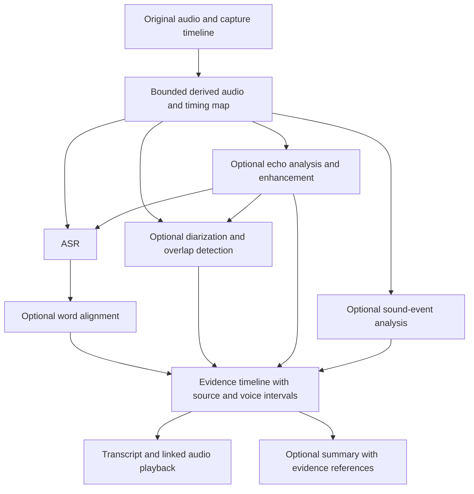

# Audio understanding: sources, speakers, and context

**Status: DESIGN — NOT IMPLEMENTED.** Written on 2026-09-07. This document proposes the next analysis layer; it does not describe capabilities added to the current release. See [local-review.md](local-review.md) for implemented behavior.

## Purpose and current boundary

ZebTrace is a history of device audio during recording periods chosen by the user. It must accommodate ordinary work, media playback, nearby speech, remote conversations, music, environmental sounds, and quiet periods. A meeting is one possible example, never the assumed setting. Capturing audio remains independent of analysis and requires no model.

The current release saves system and microphone audio separately, transcribes each source with a selected Whisper model and auxiliary Silero VAD, and uses a Qwen3 text model to summarize the recognized speech on a shared timeline. It preserves possible cross-source text duplicates with annotations. It does **not** perform speaker diarization, establish real identities, cancel acoustic echo, separate simultaneous speakers, or reliably classify environmental sounds. Qwen3-ASR is not integrated; the existing Qwen3 4B model is a text summarizer.

The proposed layer must preserve every original audio file. VAD, enhancement, echo handling, or an empty transcript cannot remove recorded sound. No recognized words means only that the pipeline produced no words; it does not prove silence or explain what the user was doing.

## Why several models?

Separating recognition from text understanding is an established product architecture, rather than a novel ZebTrace invention. Amazon explicitly describes Transcribe Call Analytics as combining speech-to-text models, LLMs, and task-specific NLP models. Its call-center specialization is evidence of the architecture, not a template for ZebTrace's product assumptions. [AWS product documentation](https://aws.amazon.com/transcribe/call-analytics/)

The exact model choices, local execution, scheduling, data format, and user experience are ZebTrace's engineering decisions. Model count is not a quality metric. An integrated provider could implement several capabilities behind one runtime; conversely, a timestamp aligner or diarizer may need additional weights. Only the capabilities the user requests should be prepared and run.

| Capability | Question answered | What it does not establish |
| --- | --- | --- |
| Speech recognition (ASR) | What words were spoken? | Who the real person is, or the meaning of all non-speech sounds |
| Speaker diarization | Which voice spoke during each interval? | A person's name or the words of every simultaneous speaker |
| Forced alignment | Where do supplied words fit in the audio? | That the supplied words are correct |
| Echo analysis / cancellation | Is microphone content a delayed playback copy, and can that copy be reduced? | That every overlapping microphone sound is redundant |
| Text understanding | What can be summarized from the available evidence? | Missing audio facts, unspoken intent, or a guaranteed correction of ASR errors |
| Optional audio-event analysis | Which supported sound events may be present? | The user's activity, location, or a complete description of the soundscape |

Azure's diarization API illustrates the distinction: its speaker IDs are generic labels, with examples such as `Guest-1` and `Unknown`, rather than verified names. [Azure diarization documentation](https://learn.microsoft.com/en-us/azure/ai-services/speech-service/get-started-stt-diarization)

## Keep source, voice, and identity separate

Use three different fields throughout storage, UI, and summaries:

| Field | Example | Ownership |
| --- | --- | --- |
| Capture source | `microphone`, `system` | Recorder metadata |
| Speaker cluster | `recording-123:voice-2`, or unknown | Versioned diarization result |
| Display identity | A user-confirmed label such as “Zeb” | User annotation, with its scope recorded |

A microphone may contain several people, playback leakage, or nobody speaking. A system track may contain several remote voices, a video narrator, or music. Never convert `microphone` to “me,” `system` to “other participant,” or the first voice to the device owner.

Start with anonymous labels scoped to a recording. Keep clustering context across file chunks so “Speaker 1” does not restart every ten minutes. Long recordings require bounded processing and a reconciliation pass; uncertain matches stay separate. Later reclustering must create a new analysis revision and retain a mapping to existing user annotations, asking the user to resolve ambiguous merges.

Allow users to rename, merge, or split speaker labels. Renaming within one recording must not silently create a cross-recording voice profile. Optional future voice enrollment needs an explicit user action, a reject/unknown outcome, and a visible, removable local profile. A spoken introduction or a name mentioned in a transcript is insufficient to establish identity automatically.

## Turn-taking and simultaneous speech

Alternating voices are the first target: diarization estimates voice intervals, ASR supplies words, and alignment associates words with those intervals. Word intervals crossing a speaker boundary or overlapping several voices remain ambiguous when the audio does not resolve them. The text model must not decide who spoke merely because the sentence sounds like a reply.

Simultaneous speech requires separate treatment:

- **Different capture sources:** independently transcribe both sources and preserve the shared interval. This can retain a microphone interjection during system playback, provided the interjection is audible and not incorrectly suppressed as echo.
- **Several voices mixed into one source:** diarization can mark overlap, but does not itself recover separate clean transcripts. An optional speech-separation stage could be evaluated on those intervals, with all separated audio marked as derived. If it is unreliable, show “overlapping speech” and incomplete/unknown words instead of inventing a fluent exchange.
- **Playback copied into the microphone:** link the two observations as a possible duplicate; this is distinct from two people speaking simultaneously.

pyannote is a useful evaluation baseline for diarization. Its official model offers regular diarization and a separate exclusive output intended to simplify transcript reconciliation. ZebTrace must preserve overlap evidence even if an exclusive presentation is used for readability. The model also has access conditions and separate weight licensing; native packaging, offline preparation, runtime size, and Mac performance must be evaluated before selecting a shipping backend. [Official model card](https://huggingface.co/pyannote/speaker-diarization-community-1)

## Relate system and microphone audio without losing speech

The saved chunk offsets are the starting timeline. Sources do not necessarily begin together; device changes and clock discontinuities may require piecewise offset/drift estimates. Filename order or equal file durations are insufficient. Keep capture timestamps immutable and record any estimated correction, its applicable interval, and uncertainty separately.

Proposed processing:

1. Decode bounded portions of each original track, retaining their sample-to-recording time mapping and source identity.
2. Estimate playback-to-microphone lag using acoustic correlation over suitable intervals. Recheck it after device changes or discontinuities. Silence, unrelated speech, or a weak match should produce “no reliable estimate.”
3. Combine acoustic similarity, lag consistency, and overlapping time with text similarity to create a `possiblePlaybackCopy` relation. Text similarity alone is insufficient: people can repeat the same phrase independently.
4. Evaluate optional acoustic echo cancellation on a **derived microphone copy**, using the system track as a reference only where the reference is valid. Keep originals and provenance available for immediate comparison.
5. Preserve near-end speech during simultaneous playback and speech. Reject enhancement output that removes an audible interjection or increases recognition errors; expose an original-audio fallback.
6. Collapse strongly supported duplicates only in the default reading view. Keep both observations accessible, with a reversible user override. An unresolved relation must remain visible to downstream summarization as uncertain.

WebRTC's audio-processing API uses separate capture and render streams and explicitly accounts for stream delay. This makes it a relevant AEC implementation to evaluate. It does not prove that ZebTrace's saved system audio is always a suitable render reference: routing, volume, Bluetooth latency, other output devices, nonlinear speaker distortion, and prior processing may differ. Simple sample subtraction is not an adequate design. [WebRTC audio-processing interface](https://webrtc.googlesource.com/src/+/refs/heads/main/api/audio/audio_processing.h)

For example, system audio may say “the temperature reached thirty degrees,” while the microphone captures a delayed copy plus “please repeat that.” The desired result retains the system utterance once in the reading view, links its microphone copy, and preserves the interjection as a separate utterance. The system voice could be a person, a recording, or synthesized speech; the example does not establish which.

## A common evidence timeline for summaries

Joint understanding should consume a structured timeline from both sources, not two unrelated summaries and not a destructive audio mix.

This is a capability graph, not a requirement to run every node. A coordinator chooses original or derived input explicitly and records that choice; it must not concatenate outputs from both paths as independent speech. A combined ASR/diarization provider may satisfy multiple nodes.

Every observation should carry a stable ID, recording ID, source, original file and time range, derived-audio lineage if any, analysis revision, model/runtime hashes, text or event label, and timing method. Speaker intervals, uncertain assignments, duplicate relations, and user edits remain separate versioned records. Provider scores are stored with their meaning; scores from different providers are not assumed to be calibrated or comparable.

Summary claims refer to observation IDs and playable time ranges. They may combine related statements across sources, while distinguishing direct evidence from an inferred relationship. Temporal proximity alone does not establish that system playback and nearby speech are discussing the same subject. Preserve unrelated parallel content as separate threads. Missing, overlapping, or low-quality evidence should reduce specificity, not invite the text model to complete the story.

Default scope is the selected recording or user-selected time range. Combining several recordings requires an explicit scope in the UI and output metadata. A longer recording can be organized into topic/time sections without labeling its entire duration as a meeting or another inferred activity. Summarizing recognized speech must remain distinct from summarizing the whole soundscape until sound-event coverage is validated.

## Replaceable capabilities and staged execution

The existing `TranscriptionProvider` and `SummarizationProvider` are the initial boundary. The following are proposed contracts, not implemented Swift APIs:

| Contract | Input | Output |
| --- | --- | --- |
| `TranscriptionProvider` | Bounded audio with time mapping and optional language preference | Words/segments, language, supported quality indicators |
| `DiarizationProvider` | Bounded audio plus continuation context | Voice intervals, overlap regions, anonymous cluster evidence |
| `AlignmentProvider` | Audio and a transcript revision | Word intervals and alignment diagnostics |
| `EchoAnalysisProvider` | Timed capture/reference pair | Lag estimates, duplicate evidence, optional derived-audio recipe |
| `SeparationProvider` | Selected overlap interval | Derived streams with input lineage and diagnostics |
| `AudioEventProvider` | Bounded audio | Supported event labels, intervals, uncertainty |
| `SummarizationProvider` | Scoped evidence timeline and output language | Claims/sections with source references |

The project owns file access, audio normalization, timing, orchestration, cancellation, caching, and result persistence. Providers declare capabilities, supported platforms, context limits, assets, license information, and runtime requirements. Model-specific prompts and output parsing stay in adapters. Future integrated audio models can fit these contracts without requiring every other stage to be rewritten.

Qwen3-ASR 0.6B and 1.7B are candidates for a controlled ASR comparison. Its official implementation separately exposes Qwen3-ForcedAligner for timestamps. This is a reason to model alignment as a capability, not evidence that replacing Whisper will automatically add diarization. No Qwen3-ASR integration or Mac performance claim is made here. [Qwen3-ASR repository](https://github.com/QwenLM/Qwen3-ASR)

## User experience, storage, and power

Keep the ordinary path short: select a recording, read its overview or transcript, and click a passage to listen. Anonymous speaker labels and source icons appear only where useful. Overlap, uncertain words, and duplicate captures are expandable annotations. Renaming a speaker or correcting text is a contextual action, not a permanent toolbar button. Preserve the recognized text beside user corrections and regenerate affected summaries explicitly.

Offer capabilities such as **Transcribe**, **Distinguish speakers**, and **Summarize**; model selection belongs in settings. Model management groups dependencies under these capabilities and shows download size, disk use, compatibility, and remove actions. A transcript-only task should not require summary weights. These independent tasks are a proposed improvement; the current review prepares the selected ASR, VAD, and text-model combination together.

All persistent model weights, derived artifacts, optional voice profiles, and analysis caches belong under the user's chosen ZebTrace data root. Model removal frees disk after running consumers stop; ending inference releases runtime memory separately. The UI must distinguish the two actions. Derived caches can be cleared without removing recordings or user edits, and active jobs hold leases to prevent deletion races.

Default to on-demand processing of saved audio. An optional automatic policy can queue completed chunks, favor AC power, yield to recording and foreground work, and checkpoint when thermal or memory pressure rises. Do not make capture depend on analysis keeping up. Use bounded audio windows, sequential heavyweight stages, resumable checkpoints, and a visible cache budget. A new model invalidates only dependent analysis stages; unchanged audio and unrelated results remain reusable.

Cancellation must stop helper work, commit only complete stage outputs, and retain prior readable results. Interrupted downloads and temporary decoded audio need bounded cleanup. Disk-pressure handling pauses analysis first and clearly reports capture failures if recording cannot continue; it must not silently delete old recordings. Measure peak memory, energy per recorded hour, thermal behavior, temporary disk growth, and cancellation latency on real supported Macs before promising all-day background analysis.

One current scaling limit is concrete: `RecordingTranscript.markPossibleDuplicates` scans prior entries for each transcript entry, giving quadratic worst-case work, without cancellation inside that pass. Replace it with a bounded temporal candidate index and cancellable batches before claiming efficient all-day analysis. Streaming ASR windows alone do not establish that the complete pipeline has bounded processing cost.

## Roadmap and acceptance evidence

The order below is proposed, with no release dates or claimed quality guarantees.

| Stage | Deliverable | Acceptance evidence required before shipping |
| --- | --- | --- |
| 1. Trustworthy transcription | Representative local ASR comparison, independent transcript task, evidence-linked playback, visible analysis revision | Human reference transcripts; Chinese CER / English WER by condition; non-speech hallucinations; timestamp error; reproducible runtime and memory measurements; no cross-recording cache reuse |
| 2. Speaker turns | Anonymous per-recording labels, optional alignment, manual correction | Human speaker intervals; diarization error including overlap; speaker-attributed transcription errors; boundary and chunk-continuity tests; unknown outcomes retained; no automatic real-name assignments |
| 3. Cross-source relations | Lag/drift estimation, conservative duplicate links, evaluated optional AEC | Playback-only, speech-only, and simultaneous playback/speech fixtures; duplicate precision/recall; missed interjections; original-versus-enhanced CER/WER; device changes and routing failures degrade to originals |
| 4. Useful joint review | Time/topic sections, cross-source summaries with citations, scoped search | Human checks of factual support, omissions, source attribution, and related versus unrelated parallel content; each claim's references resolve to the correct original audio |
| 5. Optional richer audio analysis | Evaluated overlap separation and sound-event providers | Per-event precision/recall; overlap transcription quality; separation artifacts; power/disk budgets; clearly described unsupported events |

Build the evaluation set across close and distant speech, single and multiple voices, language switches, accents, speakers taking turns, actual simultaneous speech, speaker playback leaking into a microphone, headphones, music, keyboard/environmental sounds, and no recognizable speech. Include several applications playing audio and periods of ordinary work. Do not tune solely on one short personal recording or assume two participants.

Use separate development and held-out evaluation sets. Publish model/runtime revisions, hardware, quantization, scoring rules, and breakdowns instead of a single “accuracy” percentage. Set numerical acceptance thresholds from those baselines before selecting a default model. Include long recordings, restart/resume, source discontinuities, language changes, model removal, and storage relocation in integration checks. Private recordings and identities must stay out of the open-source repository; publish only fixtures authorized for redistribution.

Across every stage, original-file hashes must remain unchanged, unknown speakers must remain representable, and every displayed claim must retain a path back to its input evidence.
